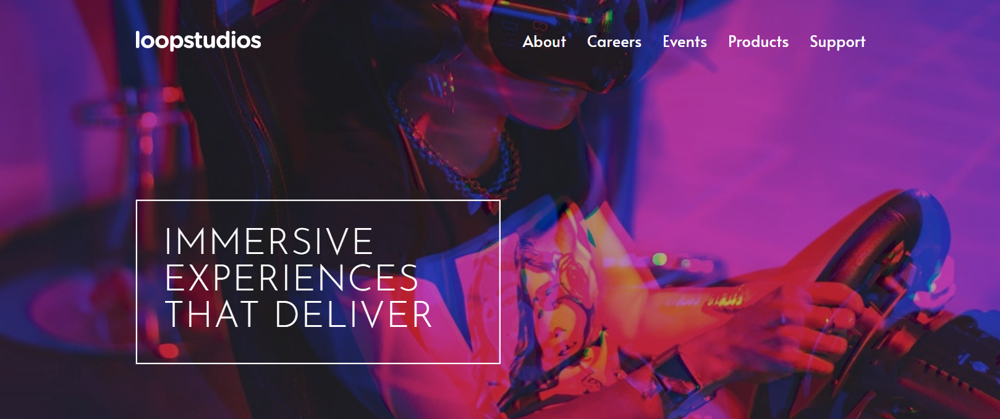

# Frontend Mentor - Loopstudios landing page solution

This is a solution to the [Loopstudios landing page challenge on Frontend Mentor](https://www.frontendmentor.io/challenges/loopstudios-landing-page-N88J5Onjw). Frontend Mentor challenges help you improve your coding skills by building realistic projects.

## Table of contents

-   [Overview](#overview)
    -   [The challenge](#the-challenge)
    -   [Screenshot](#screenshot)
    -   [Links](#links)
-   [My process](#my-process)
    -   [Built with](#built-with)
    -   [What I learned](#what-i-learned)
-   [Author](#author)

## Overview

### The challenge

Users should be able to:

-   View the optimal layout for the site depending on their device's screen size
-   See hover states for all interactive elements on the page

### Screenshot

### Links

-   Solution URL: [GitHub](https://github.com/bramuccci/loopstudios-landing-page)
-   Live Site URL: [Netlify](https://bramuccci-loopstudios-landing-page.netlify.app/)

## My process

### Built with

-   Sass
-   Webpack

### What I learned

I focus my atention on learning Webpack. Pretty happy with this practice.

## Author

-   Frontend Mentor - [@bramuccci](https://www.frontendmentor.io/bramuccci/yourusername)
-   Twitter - [@bramuccci](https://www.twitter.com/bramuccci)
